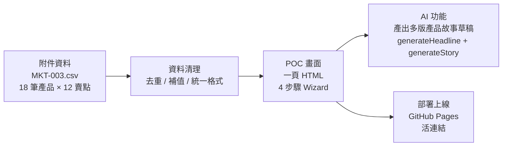

# 流程圖

```mermaid
flowchart LR
    A["附件資料\nMKT-003.csv\n18 筆產品 × 12 賣點"] --> B["資料清理\n去重 / 補值 / 統一格式"]
    B --> C["POC 畫面\n一頁 HTML\n4 步驟 Wizard"]
    C --> D["AI 功能\n產出多版產品故事草稿\ngenerateHeadline + generateStory"]
    C --> E["部署上線\nGitHub Pages\n活連結"]
```
